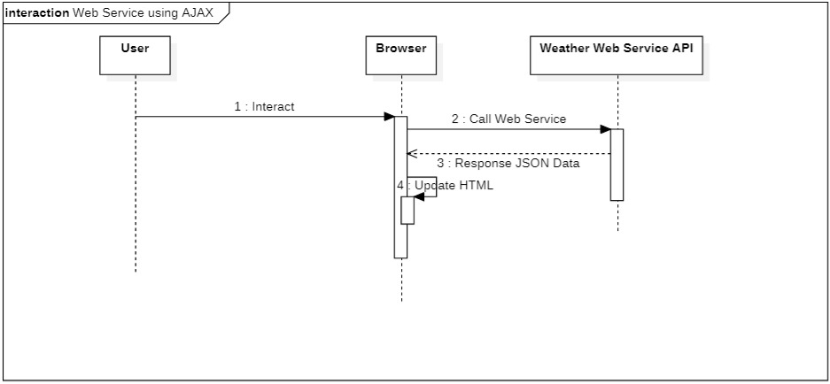

# t1
Pang Jing Hui | P1845259 

# Browser testing
## 1. Loading gif

After clicking on the "Get data" button, a spinner will be shown. 
Once the data is retrieved successfully, the spinner will disappear.

## 2. Result

Successufully loaded the result from Weather API.

## Postman testing screenshots of XML and JSON outputs:
### 1. XML Output:

### 2. Json Output:

# Sequence diagrams to show the difference between invoking web service using C# and JQuery
## C#:

## AJAX:

